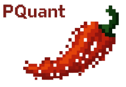
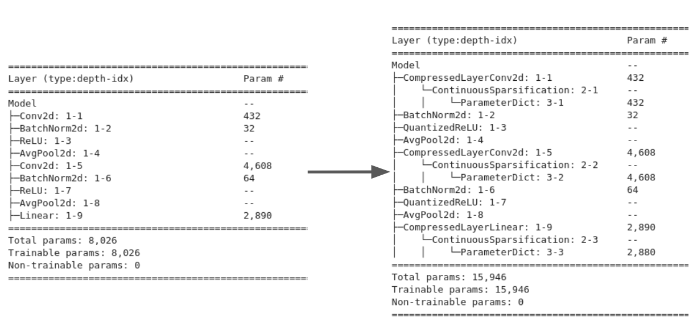

## Prune and Quantize ML models
PQuant is a library for training compressed machine learning models, developed at CERN as part of the [Next Generation Triggers](https://nextgentriggers.web.cern.ch/t13/) project.

PQuant replaces the layers and activations it finds with a Compressed (in the case of layers) or Quantized (in the case of activations) variant. These automatically handle the quantization of the weights, biases and activations, and the pruning of the weights. 
Both PyTorch and TensorFlow models are supported. 

Layers that can be compressed: Conv2D and Linear layers, Tanh and ReLU activations for both TensorFlow and PyTorch. For PyTorch, also Conv1D.



The various pruning methods have different training steps, such as a pre-training step and fine-tuning step. PQuant provides a training function, where the user provides the functions to train and validate an epoch, and PQuant handles the training while triggering the different training steps.


### Example
Example notebook can be found [here](https://github.com/nroope/PQuant/tree/main/examples). It handles the
  1. Creation of a torch model and data loaders.
  2. Creation of the training and validation functions.
  3. Loading a default pruning configuration of a pruning method.
  4. Using the configuration, the model, and the training and validation functions, call the training function of PQuant to train and compress the model.
  5. Creating a custom quantization and pruning configuration for a given model (disable pruning for some layers, different quantization bitwidths for different layers).

### Pruning methods
A description of the pruning methods and their hyperparameters can be found [here](docs/pruning_methods.md).


### Installation

```pip install .``` for regular install, ```pip install -e .``` if you wish to install as a local editable package
To run the code, [HGQ2](https://github.com/calad0i/HGQ2) is also needed. For now it only has local install available, so download the repository and install it locally.

### Authors
 - Roope Niemi (CERN)
 - Anastasiia Petrovych (CERN)
 - Chang Sun (Caltech)
 - Michael Kagan (SLAC National Accelerator Laboratory)
 - Vladimir Loncar (CERN)
